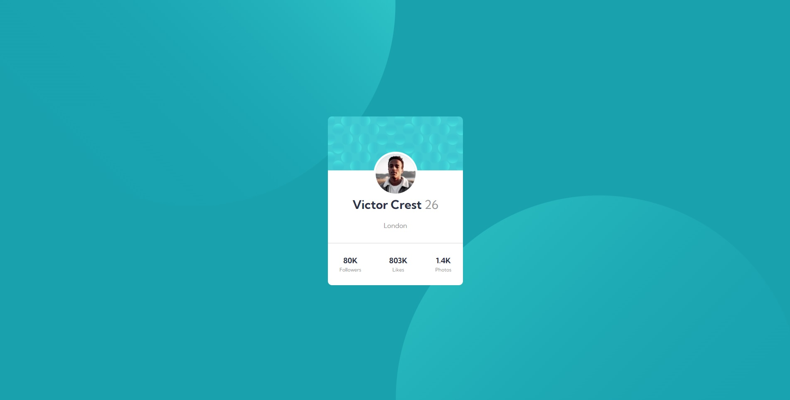

# Frontend Mentor - Profile card component solution

This is a solution to the [Profile card component challenge on Frontend Mentor](https://www.frontendmentor.io/challenges/profile-card-component-cfArpWshJ). Frontend Mentor challenges help you improve your coding skills by building realistic projects. 

## Table of contents

- [Overview](#overview)
  - [The challenge](#the-challenge)
  - [Screenshot](#screenshot)
  - [Links](#links)
- [My process](#my-process)
  - [Built with](#built-with)
- [Author](#author)
- [Acknowledgments](#acknowledgments)

**Note: Delete this note and update the table of contents based on what sections you keep.**

## Overview

### The challenge

- Build out the project to the designs provided

### Screenshot

### Links

- Solution URL: [Frontend Mentor solution](https://www.frontendmentor.io/solutions/nft-card-component-using-flexbox-and-grid-AHaHYqzyy)
- Live Site URL: [Netlify site](https://hopeful-sinoussi-ccaa0f.netlify.app)

## My process

### Built with

- Semantic HTML5 markup
- CSS custom properties
- Flexbox
- CSS Grid
- Sass
- Mobile-first workflow

## Author

- Frontend Mentor - [@EdwinCacuango](https://www.frontendmentor.io/profile/yourusername)
- Twitter - [@edwincacuango](https://twitter.com/edwincacuango)

## Acknowledgments

For the mobile background, maybe it's easy if you create like a simple image with any design tool. It´s really hard to make a perfect solution for every screen. 

